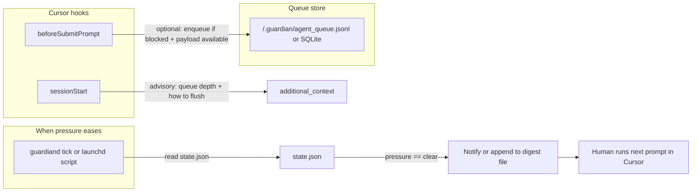

# Guardian-backed local agent work queue

## What exists today

- The **`guardiand`** daemon writes live metrics to `~/.guardian/state.json` (`pressure`, CPU, memory, swap, Cursor RSS, disk). See [README](../README.md).
- **[`hooks/before-submit-prompt.sh`](../hooks/before-submit-prompt.sh)** can **`continue: false`** when policy says block; **[`hooks/session-start.sh`](../hooks/session-start.sh)** injects **`additional_context`** advisories. Resume paths are **`proceed_once`** and **`snooze_until`** ([`hooks/resources.md`](../hooks/resources.md)).
- **[`src/session_db.rs`](../src/session_db.rs)** (`sessions.db`) tracks **sessions / tool_calls / pressure_samples** for the SwiftUI app — not a deferred prompt queue.

There is **no** first-class “execute this prompt in Cursor when load drops” API in the Guardian stack today.

## Feasibility

| Idea | Feasible? | Notes |
|------|-----------|--------|
| **Advise** the user/agent to use a queue (text in `user_message` / `additional_context`) | Yes | Matches Guardian’s “inform, don’t only block” design ([`hooks/lib.sh`](../hooks/lib.sh) comments). |
| **Persist** queue entries under `~/.guardian/` (JSONL or new SQLite table) | Yes | Same pattern as `sessions.db` + shell `sqlite3` in hooks. |
| **Detect** “resource usage went down” | Yes | Poll `state.json` or extend **Rust** daemon with a transition callback (pressure `critical` \| `strained` → `clear`). |
| **Automatically submit** the next queued prompt inside Cursor | **Not** without extra tooling | Hooks return JSON to Cursor; they do not drive the Composer UI. Need **manual paste**, a **Cursor extension**, or **OS automation** (fragile). |
| **Notify** user when queue is ready to run (pressure clear) | Yes | `osascript` / Notification Center, or log line for a menu bar app. |

## Recommended architecture

1. **Queue storage (global)**  
   - Default: **`~/.guardian/agent_queue.jsonl`** (append-only, one JSON object per line: `id`, `enqueued_at`, `title`, `body`, `source`, `conversation_id` optional).  
   - Alternative: new table **`prompt_queue`** in existing SQLite ([`session_db.rs`](../src/session_db.rs)) if you want queries and a single DB for the SwiftUI app later.

2. **Enqueue**  
   - **Manual / CLI**: `guardian-queue add "title" "body"` (small script in Guardian repo or `scripts/`).  
   - **On block (optional)**: In [`before-submit-prompt.sh`](../hooks/before-submit-prompt.sh), when emitting `continue: false`, **if** the hook stdin JSON includes a stable field for prompt text (confirm against current Cursor hook docs / capture one sample payload), append that body to the queue and extend `user_message` with: *“Queued as &lt;id&gt;. Run `guardian-queue list` or wait for notification.”*  
   - If Cursor **does not** expose prompt text, only document “copy into queue” + CLI.

3. **“Execute when resources go down”**  
   - **Safe default**: do **not** auto-execute; **notify** when `pressure` transitions to `clear` (or stays `clear` and queue non-empty).  
   - **Implementation options** (pick one):  
     - **A)** Small **LaunchAgent** running every N seconds: shell script compares previous vs current `pressure` from `jq`, on transition fires notification + optional `open` of a `queue-next.txt` file.  
     - **B)** Extend **`guardiand`** (Rust) to emit a line to a log or run a configurable **`on_pressure_clear` hook** path from [`scripts/install.sh`](../scripts/install.sh) default `config.toml` — fewer moving parts, single process.

4. **Advisory copy**  
   - Extend [`session-start.sh`](../hooks/session-start.sh) (or a shared `lib.sh` helper) to add one line when `wc -l` of queue &gt; 0: e.g. *“N deferred agent tasks in ~/.guardian queue; run when pressure is clear.”*

## Policy / safety

- Queue files may contain **secrets** — permissions `0600`, warn in README.  
- **Fail-open**: if enqueue fails, blocking behavior unchanged (`continue: false` still works).  
- Align with lessons learned: hooks should **not** `deny` in a way that bricks Cursor; queue logic stays **advisory + file I/O**, same as current gates.

## Implementation phases (when you build it)

1. **Spec**: Confirm **Cursor `beforeSubmitPrompt` payload** fields (sample stdin once).
2. **Storage + CLI**: `agent_queue.jsonl` + `guardian-queue` add/list/pop/peek.
3. **Notifier**: LaunchAgent or `guardiand` hook on pressure transition.
4. **Hook integration**: optional enqueue-on-block + sessionStart queue depth.
5. **Docs**: [`README.md`](../README.md) section “Deferred work queue”.

## Summary

**Yes — Guardian is a good fit to *advise* and *manage* a local global queue** (shared state under `~/.guardian/`, pressure from `state.json`, hooks for messaging). **Execution** of queued prompts in Cursor should be treated as **human-in-the-loop** (notification + paste) unless you invest in an extension or automation explicitly.
